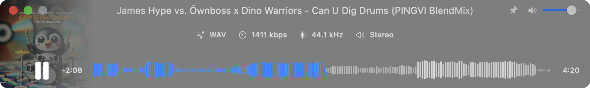

  

# MIMP (Minimal Interface Music Player)

## The Story Behind MIMP

As a DJ, I frequently download large music packs from various DJ pools like Hypeddit and others. One common challenge is the need to efficiently preview numerous tracks to find the right ones for your sets. This process can be time-consuming, especially when you need to quickly identify drops and breakdowns in tracks.

That's why I created MIMP - a minimalistic music player specifically designed for DJs. It focuses on essential features that matter most to DJs, without any unnecessary complexity. The waveform visualization allows you to quickly jump to drops or breakdowns, saving valuable time during track selection and preparation.

## Key Features

- **Streamlined Music Preview**: Fast and efficient way to preview multiple tracks
- **Visual Waveform Display**: Quickly identify track structure, drops, and breakdowns
- **Audio Information Display**: View bitrate, sample rate, and channel information
- **Format Support**: Compatible with all major DJ-friendly formats:
  - MP3
  - AIFF
  - FLAC
  - WAV
  - M4A
- **Minimalistic Interface**: Focus on what matters - the music
- **Native Performance**: Built specifically for Apple Silicon Macs (compatible with Intel Macs)
- **Auto-Updates**: Built-in updater to keep your app current
- **Compact Mode**: Streamlined view for minimal screen space usage

## Controls 

- **Space bar / F8**: Play/Pause
- **Double-click on title**: Expands the application to full width
- **Cmd + Q**: Quit application
- **Cmd + H**: Hide application
- **M key**: Mute/Unmute
- **P key**: Keep window always on top
- **C key**: Enter compact mode
- **I key**: Open About
- **U key**: Open Updater (if available)
- **S key**: Stop/Play track

## Technical Details

### Requirements

- macOS 13.5+
- Swift 5.5+
- Apple Silicon Mac (Intel Mac compatible)

### Additional Features
- Remaining time display
- Set as default player option
- Auto-updater with version checking
- Audio format details display
- Compact mode for minimal interface

## Credits

- Developed with the assistance of Claude 3.5 Sonnet
- Custom application icon designed by myself :P

### P.S.
I'll be glad if knowledgeable people help with updating the app. Implementing an accurate BPM indicator, key detection, and other features useful for DJs.

Let's make the world a little simpler together :)

